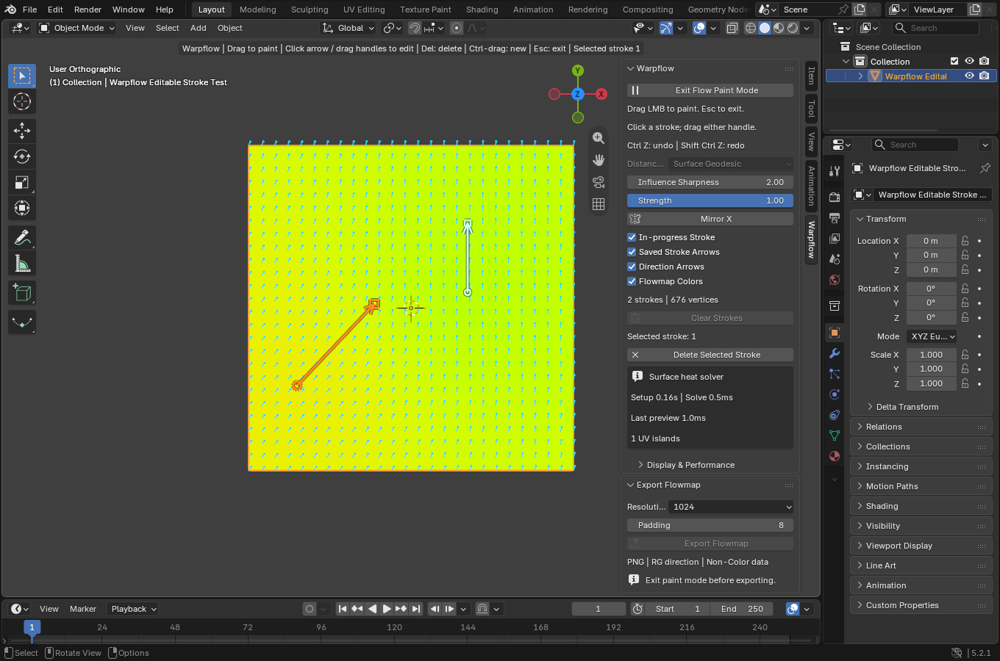

# Warpflow

### Paint directions. Build a flowmap.

Warpflow is a Blender add-on for painting flow directions directly on a mesh. Draw a few strokes, adjust their handles, and watch the direction field update across the surface. Export the result as a PNG flowmap for your shader.

**Blender 5.0+ · Windows x64 · Version 1.0**

## Download

### [Download Warpflow 1.0 for Windows](https://github.com/Ephaistophedes/Warpflow/releases/latest/download/Warpflow-1.0-windows-x64.zip)

[Release notes and checksum](https://github.com/Ephaistophedes/Warpflow/releases/latest) · [Installation](#installation) · [Quick start](#quick-start) · [Controls](#controls) · [Report an issue](https://github.com/Ephaistophedes/Warpflow/issues)

Download the add-on ZIP using the link above. GitHub's **Code → Download ZIP** downloads the repository, which is not the Blender installer.

*Viewport example: a few editable strokes guide the direction field across the mesh.*

## What you can do

- **Paint a complete flow field.** The first stroke establishes a direction across the mesh; additional strokes shape the transitions.
- **Edit strokes live.** Move the start or tip of a saved arrow and see the field update. Undo and redo completed edits.
- **Mirror across X.** Paint linked strokes across the object's local X plane, with paired editing and deletion.
- **Choose how influence travels.** Use Surface Geodesic to follow the mesh surface, or Volumetric to travel through a closed mesh's interior.
- **Choose the blue channel.** Switch between **0** (black), **1** (white), and **0.5** (mid grey) with mutually exclusive checkboxes. The choice updates live and is included in export.
- **Save and reuse guides.** Store strokes in your `.blend`, or export and import guide JSON files between matching meshes.
- **Export a PNG flowmap.** Bake the field using your UV layout, with selectable resolution and padding.

## Installation

1. Download **Warpflow-1.0-windows-x64.zip** above. Keep it zipped.
2. In Blender, open **Edit → Preferences → Add-ons**.
3. Open the menu at the top right and choose **Install from Disk**.
4. Select the downloaded ZIP and enable **Warpflow**.
5. In the 3D View, press **N** and select the **Warpflow** sidebar tab.

**Updating?** Restart Blender before installing the new ZIP so the bundled libraries are released.

### Compatibility

The supplied installer is for **Windows x64**. Blender **5.0+** is the compatibility target; runtime testing was performed in **Blender 5.2.1 LTS**. Blender 5.0 has not been separately runtime-tested.

The installer includes the numerical dependencies for supported Python versions. No separate `pip` installation is needed. macOS and Linux packages are not provided.

## Quick start

1. **Prepare your mesh.** Select one editable mesh in Object Mode with an existing UV unwrap. Disable viewport modifiers and make shared mesh data single-user before painting.
2. **Choose the distance mode.** Surface Geodesic is the default. Choose Volumetric before entering paint mode if you want influence through a closed object's interior.
3. **Enter Flow Paint Mode.** Left-click and drag on the surface, then release to create a stroke.
4. **Shape the flow.** Add strokes elsewhere, or select a saved arrow and drag either endpoint. Increase Influence Sharpness for tighter transitions. Strength controls the next stroke's blend.
5. **Set blue.** Select **0**, **1**, or **0.5** under Blue Channel. The red/green flow directions stay the same.
6. **Export.** Press Esc to leave paint mode, then choose your resolution and padding under Export Flowmap and save the PNG.

Save the `.blend` to retain your strokes, colors, and blue-channel selection. Geometry, transforms, and UVs are cached during painting; after changing them, clear the old strokes before starting a new field.

## Controls

| Action | Control |
| --- | --- |
| Create a stroke | Left-drag on the surface, then release |
| Select a stroke | Click its saved arrow |
| Move the source | Drag the round start handle |
| Change direction | Drag the square tip handle |
| Paint over an existing arrow | Ctrl-drag |
| Delete the selected stroke | Delete / X |
| Cancel an unfinished stroke or edit | Right-click |
| Undo / redo | Ctrl-Z / Ctrl-Shift-Z |
| Leave paint mode | Esc; during an endpoint edit, the first Esc cancels the edit |
| Navigate the view | Normal orbit, pan, and zoom |

Use **In-progress Stroke**, **Saved Stroke Arrows**, **Direction Arrows**, and **Flowmap Colors** to control the viewport display. Completed guides remain visible after leaving paint mode when Saved Stroke Arrows is enabled.

## Mirror and distance modes

**Mirror X** reflects new strokes across the object's local X=0 plane. A matching surface must exist on the opposite side. With mirroring enabled, linked strokes can be selected, edited, and deleted as a pair. Turning the option off keeps existing strokes and creates subsequent strokes individually.

**Surface Geodesic** follows connected mesh topology. **Volumetric** follows paths through the mesh interior and requires a closed manifold mesh. Higher Volumetric Resolution can preserve narrower passages at greater setup and memory cost. Change distance mode after exiting paint mode, then re-enter to rebuild the field.

## Import and export guides

Exit paint mode and choose **Export Guides** to save the completed strokes as JSON. On a matching destination mesh, choose **Import Guides**, then **Append** or **Replace**.

The destination must have matching local geometry, vertex order, topology, and active UV coordinates. It may have a different object transform. Use matching influence, distance, and scale settings to reproduce the field. Guide JSON stores editable strokes; PNG export stores the flow texture.

## Export and shader setup

- Choose **512**, **1024**, **2048**, or **Custom** resolution, with padding in pixels.
- Export uses the active UV map in a single **0–1 UV tile**. UDIMs and out-of-tile UVs are unsupported.
- Unwrap without unintended overlaps. The bake uses the painted base mesh, without evaluated modifiers.
- The output is a **16-bit RGBA PNG**. Load it as **Non-Color / linear data** in your shader or engine.

| Channel | Stored value |
| --- | --- |
| Red | U direction × 0.5 + 0.5 |
| Green | V direction × 0.5 + 0.5 |
| Blue | Selected constant: 0, 1, or 0.5 |
| Alpha | 1 |

Decode the direction with `RG * 2 - 1`, then normalize nonzero samples. Neutral flow is `RG = (0.5, 0.5)`; allow a small tolerance for PNG quantization. Blue applies to painted pixels, padding, and the uncovered background. Changing blue changes the channel encoding, not the coordinate space.

Directions use the active UV map's tangent coordinates. Shared vertices have one stored direction, so UV seam corners cannot hold independent values unless the mesh vertices are split.

## Help

[Report a bug or request a feature](https://github.com/Ephaistophedes/Warpflow/issues). Include your Blender version, operating system, steps to reproduce, and the error message or screenshot if available.

Maintained by [Ephaistophedes](https://github.com/Ephaistophedes).

## License and credits

Warpflow's Python code is licensed under **GNU GPL v3 or later**. See [LICENSE](LICENSE) and [third-party notices](THIRD_PARTY.md). The installer includes the add-on's Python source and dependency license notices.
